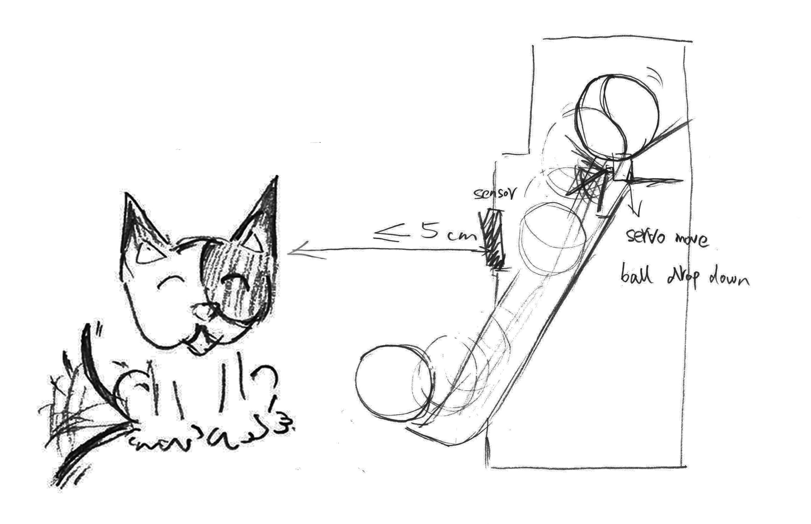

# <b>pet-center-arduino</b>
Arduino code and build set up for Pet Center Project.

<h1><b>Introduction</b></h1>

My project is a pet self-entertainment facility. This project is launched for the pet owners and their pets. The pets’ owners do not have to worry about their pet lonely when they left home for work, since their pets can have fun with this pet self-entertainment facility. 

<h1><b>Part One: Arduino UNO R3 and one sensor control two micro servo</b></h1>

This is the original function is when the sensor detective a pet coming, it will automatic release and drop a ball to the pet.

<ol>
  
  
</ol>
<h3>Step 1: Parts List</h3>
<ul>
  <li>One Arduino UNO R3</li>
  <li>One HC-SR04 Ultrasonic Sensor</li>
  <li>One Red LED</li>
  <li>One Green LED</li>
  <li>One Half Breadboard</li>
  <li>Male to Male Wires</li>
  <li>Two Micro Servos</li>
</ul>

<h3>Step 2: Connect the sensor and make sure it works</h3>

Connect the sensor and use the Arduino libraries as resource to make sure it works.

<h3>Step 3: Test your sensor and led lights</h3>

Copy the code (Simple Arduino and HC-SR04 Example, which was created by jsvester for arduino) to your Arduino and test the LED lights. The sensor will measure the distance, if the distance is less than or equal to 5cm the red LED lights; otherwise, the green LED light will light.

<ol>
  
  
</ol>

<h3>Step 4: Connect the components</h3>

Connect the components and wires as shown in the two pictures.

After you have successfully connected to a micro servo, the sensor can control micro servo to move, and when the distance is less than or equal to 5cm, the red LED will light and the micro servo will rotate 180 degrees and back. On the other hand, when the green LED light is on (or the distance is greater than 5cm), the micro servo will do nothing. Then you can connect another micro servo.

<ol>
  
  
  
</ol>

<h3>Step 5: Upload the code</h3>

Upload the code: arduino code to arduino code(one sensor control two micro servo)

Then, you can set everything up with the hardboards.

<ol>
  
  
</ol>

<h1><b>Part Two: Arduino UNO R3 and two sensors control two micro servos separately</b></h1>

Based on the original function I decided to add a new extension function: a new UNO Arduino board linked and controlled two different side sensors with servo micro. This means, no matter which direction (front, left, and right) the pet comes from, she can always get something. 

  

<h3>Step 1: Parts List</h3>
<ul>
  <li>One Arduino UNO R3</li>
  <li>Two HC-SR04 Ultrasonic Sensor</li>
  <li>Two Red LED</li>
  <li>Two Green LED</li>
  <li>Two to three half Breadboard</li>
  <li>Male to MaleWires</li>
  <li>Two micro servos</li>
</ul>

  
<h3>Step 2: Connect the sensor and make sure it works</h3>

Connect the sensor and use the Arduino libraries as resource to make sure it works.

<h3>Step 3: Test your sensor and led lights</h3>

Copy the code (Simple Arduino and HC-SR04 Example, which was created by jsvester for arduino) to your Arduino and test the LED lights. The sensor will measure the distance, if the distance is less than or equal to 5cm the red LED lights; otherwise, the green LED light will light.

<ol>
  
  
</ol>

<h3>Step 4: Connect the components</h3>

Connect the components and wires as shown in the pictures.

<ol>
  
  
</ol>

<h3>Step 5: Upload the code</h3>

Upload the code: arduino code (two sensor control two micro servo separately)

  
 
